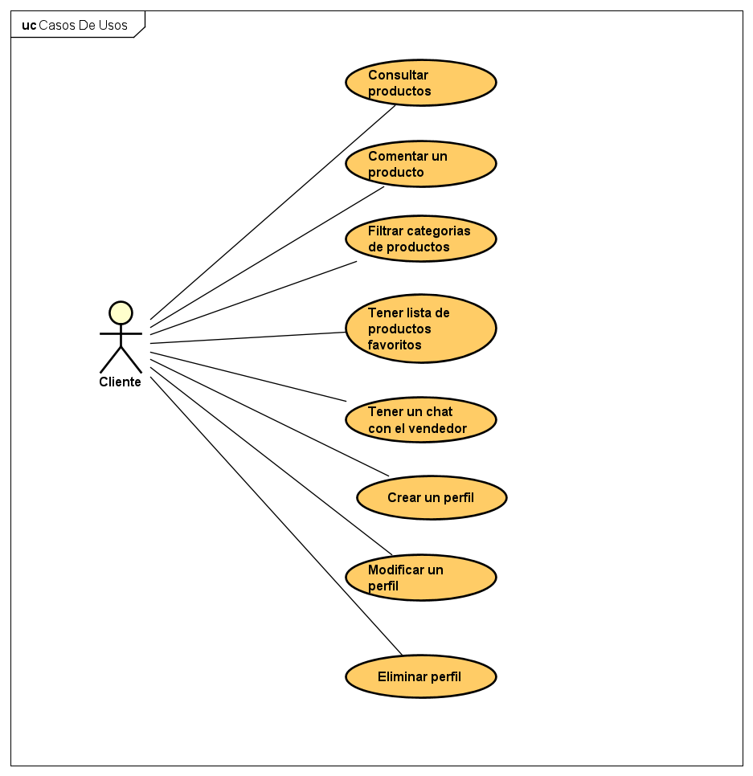
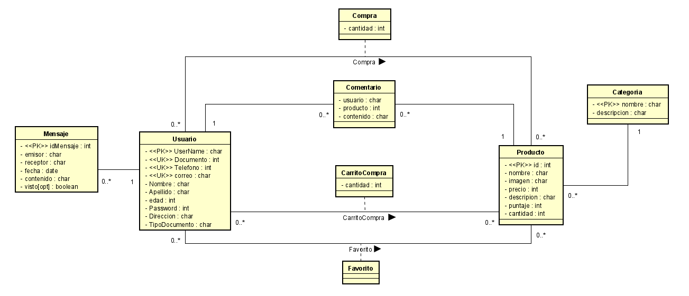
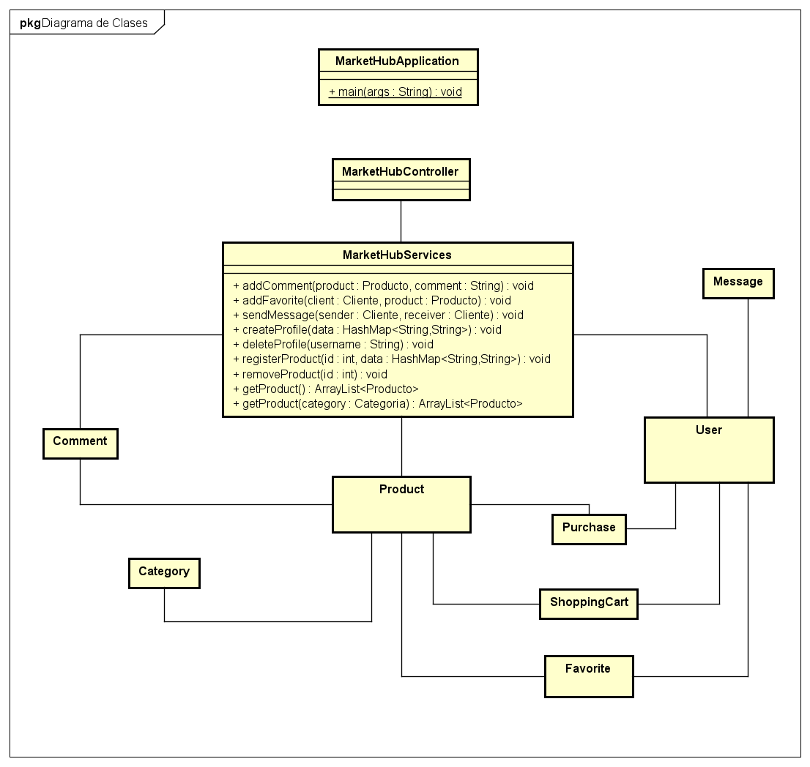
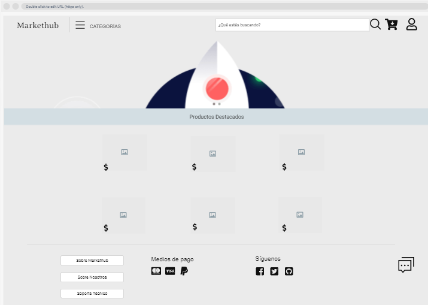
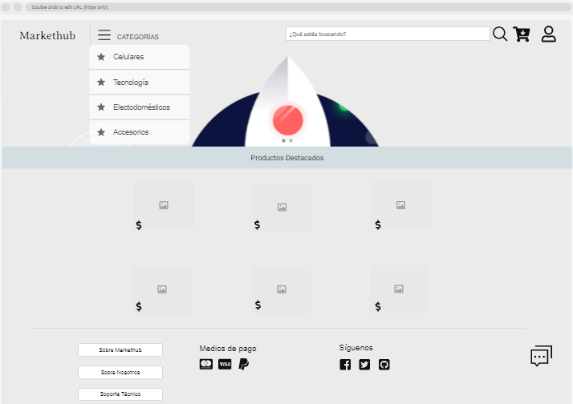
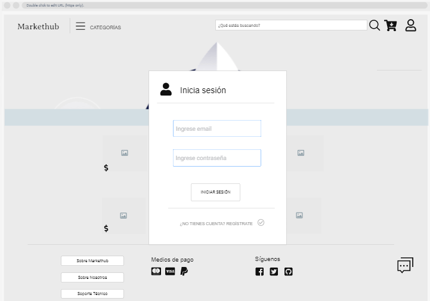
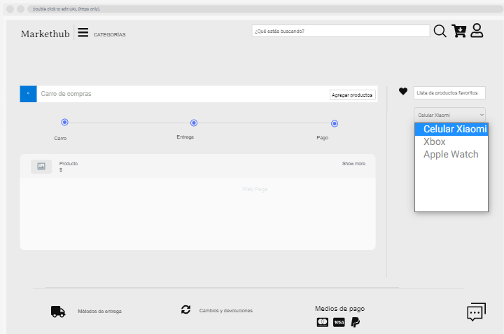

# MarketHub 🛒

## Proyecto-ARSW-MarketHub-2021-1

## Descripción del producto 📄

MarketHub ayuda a los vendedores a tener una herramienta útil y segura para realizar sus ventas, además de brindar la
posibilidad de realizar compras al por mayor.

Con MarketHub se busca brindar al vendedor una mejor experiencia al momento de vender sus productos sin necesidad de
pagar una comisión a terceros por vender estos productos, y a los clientes una confianza en una plataforma intuitiva,
segura y sobre todo en tiempo real en la cual el este informado al instante sobre todos los cambios que se realicen.

Haga click [aqui](./Documentacion/Documentacion.docx) para ver mas informacion sobre el proyecto.

## Integrantes ✒️

-   Daniel Felipe Rincon Muñoz - [danielrincon-m](https://github.com/danielrincon-m)
-   Paula Andrea Guevara Sanchez - [PaulaSanchez810](https://github.com/PaulaSanchez810)
-   Andres Mateo Calderon Ortega - [Candres1019](https://github.com/Candres1019)

### Despliegue en Heroku ☁️

### Calidad del Código 🛡️

### Integracion Continua ✔️

### Scrum Task Plan 🎤

## Arquitectura y Diseño 🔧

### Diagrama de Casos de Uso 👳

#### Caso de Uso de un Comprador

#### Caso de Uso de un Vendedor

### Diagrama de Entidades 🎖️

### Diagrama de Clases 📐

## Mockups 💻 📱

### Vista incial

### Vista de Categorías

### Vista de login

### vista carro de compras

## Construido Con

-   [Java 8](https://www.java.com/es/) - Lenguaje de Programación.
-   [JUnit](https://junit.org/junit5/) - Pruebas de Unidad.
-   [Maven](https://maven.apache.org/) - Manejo de dependecias.
-   [IntelliJ IDEA](https://www.jetbrains.com/es-es/idea/) - Entorno de Desarrollo.
-   [Visual Studio Code](https://code.visualstudio.com) - Entorno de Desarrollo.

## Licencia

Este proyecto está licenciado bajo la GNU v3.0 - ver el archivo [LICENSE](LICENSE) para más detallesbc
