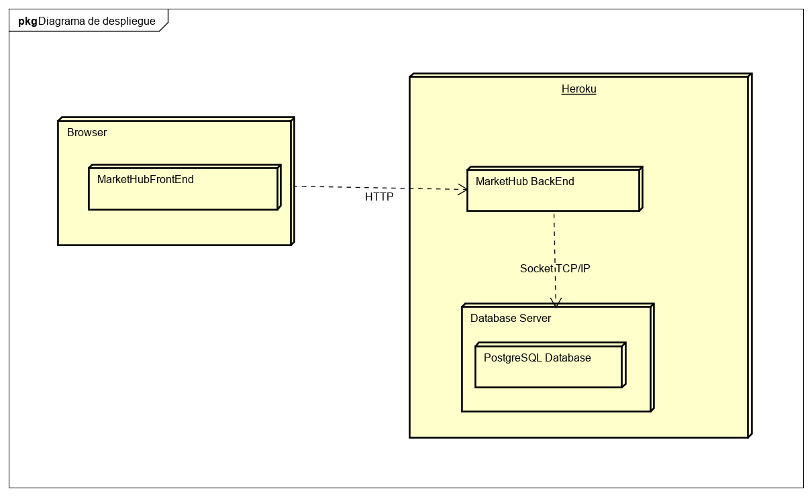
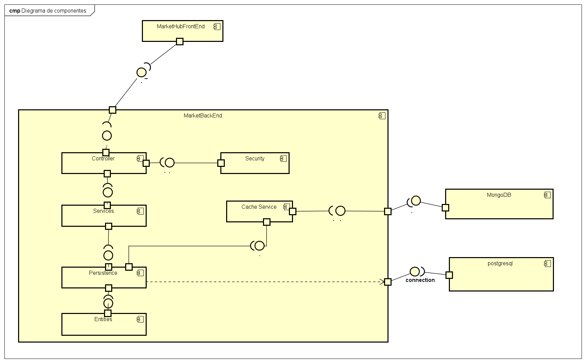

# MarketHub 🛒

## Proyecto-ARSW-MarketHub-2021-1

## Descripción del producto 📄

MarketHub ayuda a los vendedores a tener una herramienta útil y segura para realizar sus ventas, además de brindar la
posibilidad de realizar compras al por mayor.

Con MarketHub se busca brindar al vendedor una mejor experiencia al momento de vender sus productos sin necesidad de
pagar una comisión a terceros por vender estos productos, y a los clientes una confianza en una plataforma intuitiva,
segura y sobre todo en tiempo real en la cual el este informado al instante sobre todos los cambios que se realicen.

Haga click [aqui](./Documentacion/Documentacion.docx) para ver mas informacion sobre el proyecto.

### Manual de Usuario

Haga click [Aqui](/Documentacion/MarketHubManualdeUsuario.pdf) para ver el documento del manual de usuario 

## Integrantes ✒️

-   Daniel Felipe Rincon Muñoz - [danielrincon-m](https://github.com/danielrincon-m)
-   Paula Andrea Guevara Sanchez - [PaulaSanchez810](https://github.com/PaulaSanchez810)
-   Andres Mateo Calderon Ortega - [Candres1019](https://github.com/Candres1019)

### Despliegue en Heroku ☁️

### Calidad del Código 🛡️

### Integracion Continua ✔️

### Scrum Task Plan 🎤

## Arquitectura y Diseño 🔧

### Diagrama de Casos de Uso 👳

#### Caso de Uso de un Comprador

#### Caso de Uso de un Vendedor

### Diagrama de Entidades 🎖️

### Diagrama de Clases 📐

### Diagrama de Despliegue

### Diagrama de Componentes

---

## Atributos No Funcionales

En este proyecto decidimos documentar dos escenarios que muestren nuestra apropiación del requerimiento no funcional. Escogimos la Usabilidad y la demostraremos por medio del uso de las pruebas A/B y de la herramienta Crazy Egg

### Prueba A/B
El A/B Testing consiste en desarrollar y lanzar dos o más versiones de un mismo elemento y medir cuál funciona mejor. Es una prueba que nos sirve para optimizar una estrategia de marketing o para mejorar la usabilidad de una pagina web.

### Funcionamiento 
Este método consiste en desarrollar dos versiones de un mismo elemento que vamos a lanzar al mercado, y luego utilizar las métricas de cada variación para evaluar cuál funciona mejor.

En nuestro caso decidimos usar algunas modificaciones como lo fueron:

* Cambiar palabras, colores, tamaños y ubicación textos.
* Cambiar titulares de la descripción de algunos productos.
* Reducir la extensión de un formulario y tipos de campos.
* Cambiar algunas imágenes de productos.

### Crazy Egg

Crazy Egg es una herramienta de usabilidad y optimización web que monitoriza la actividad de los usuarios en una página web. Permite extraer información muy útil de cara a ver cómo se navega la página, ya que muestra, por ejemplo, en qué secciones de la web se detienen los usuarios, hasta qué punto hacen scroll, dónde hacen clic, etc. Con estos datos se pueden tomar decisiones cruciales tanto de diseño como de usabilidad.

#### Generamos Scroll maps que nos muestran el contenido más visualizado de nuestro API

#### Generamos Heat maps que nos muestran el contenido más clickeado junto con sus elementos relacionados de nuestro API:

#### Generamos Confetti maps que básicamente es un heat map ampliado que muestra las fuentes de referencia que generan la mayor cantidad de clics y la tendencia de estos en el API:

#### Finalmente generamos estadísticas por cada elemento disponible para saber que elementos eran los que estaban recibiendo más interacciones:

---

## Mockups 💻 📱

### Vista incial

### Vista de Categorías

### Vista de login

### vista carro de compras

## Construido Con

-   [Java 8](https://www.java.com/es/) - Lenguaje de Programación.
-   [JUnit](https://junit.org/junit5/) - Pruebas de Unidad.
-   [Maven](https://maven.apache.org/) - Manejo de dependecias.
-   [IntelliJ IDEA](https://www.jetbrains.com/es-es/idea/) - Entorno de Desarrollo.
-   [Visual Studio Code](https://code.visualstudio.com) - Entorno de Desarrollo.

## Licencia

Este proyecto está licenciado bajo la GNU v3.0 - ver el archivo [LICENSE](LICENSE) para más detallesbc
